# Multi-Arch CI Test Template
This project serves as a template for multi-arch tests for RedHat's downstream CI. Currently, this template test can be run only on Jenkins enviroments deployed with the tools provided by the [Multi-Arch CI Provisioner](https://github.com/RedHat-MultiArch-QE/multiarch-ci-provisioner). The only known environment that supports this exists internal to RedHat; however, efforts are being made to support further multi-arch testing upstream as part of the great CentOS CI initiative (see [multiarch-openshift-ci](https://github.com/CentOS-PaaS-SIG/multiarch-openshift-ci) for an example of this effort specifically for OpenShift). You can see our latest template release notes [here](https://github.com/RedHat-MultiArch-QE/multiarch-ci-test-template/releases).

## Table of Contents
- [Getting Started](#getting-started)
  - [Forking the Template](#forking-the-template)
  - [Creating Your Own Jenkins Job](#creating-your-own-jenkins-job)
  - [Running the Test](#running-the-test)
- [License](#license)
- [Authors](#authors)
- [Further Documentation](#further-documentation)

## Getting Started
The only current Jenkins [instance](https://multiarch-qe-jenkins.rhev-ci-vms.eng.rdu2.redhat.com) equipped with the tools and configuration capable of running this test template is internal to RedHat. This guide assumes that you have admin access to this enviroment, or have been able to set up an equivalent enviroment with the [Multi-Arch CI Provisioner](https://github.com/RedHat-MultiArch-QE/multiarch-ci-provisioner) installed.

### Forking the Template
1. In the github UI, fork this project.
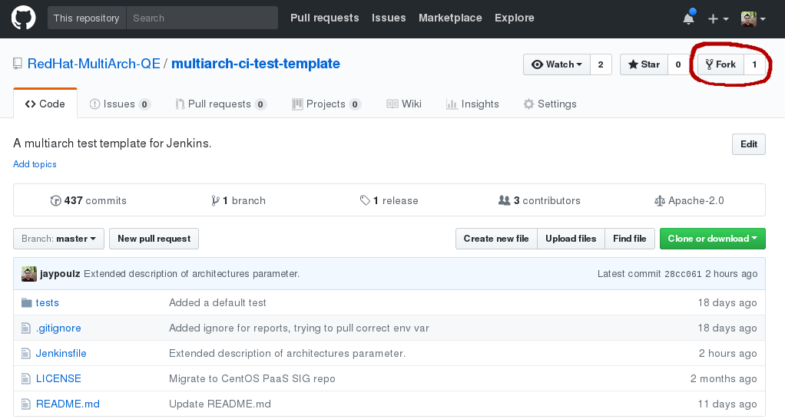

### Creating Your Own Jenkins Job
1. Log in to [Multi-Arch QE Jenkins](https://multiarch-qe-aos-jenkins.rhev-ci-vms.eng.rdu2.redhat.com).
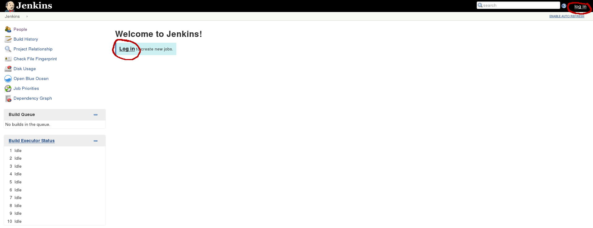

2. Navigate to your teams directory. You may need a create a directory for your team if one does not already exist.
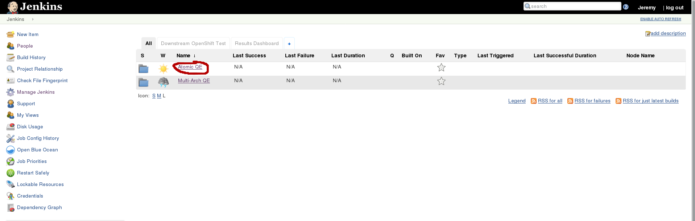

3. Select `new item`.
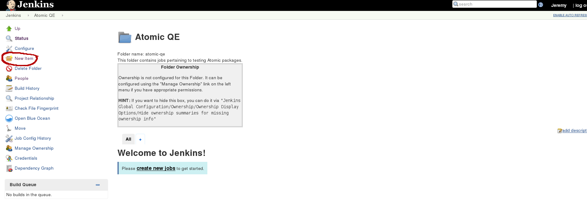

4. Name your test. I recommend keeping the name lowercase and using dashes as delimiters between words, since the test name will be used as a directory name when it is run, and special characters have been known to cause problems because of this.
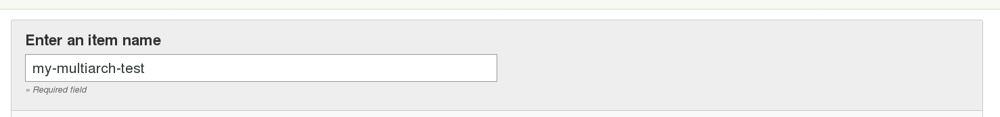

4. For pipeline type, select `Multi-Branch Pipeline`.
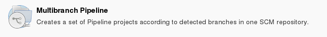

5. Select `OK` at the bottom of the page.

6. Under `Branch Sources` select `Add source->Github`.
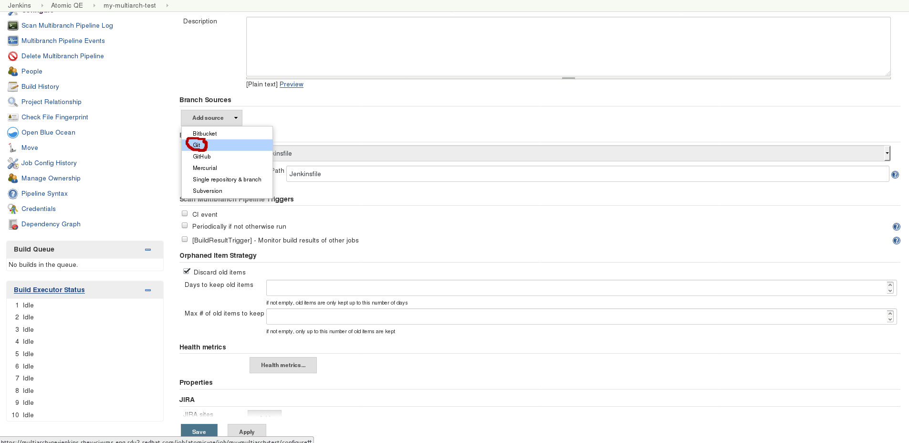

6. In the new `Branch Sources->Git` section, fill in the `Project Repository` filed with the Github URL of your fork of this project.
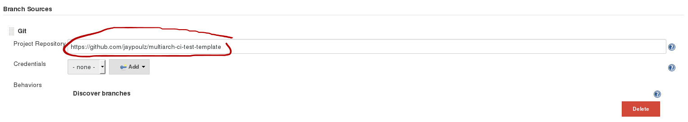

7. Hit `Save`. This should scan the repo for branches and kickoff builds for each branch. Since you cloned the template, the only branch should be master.
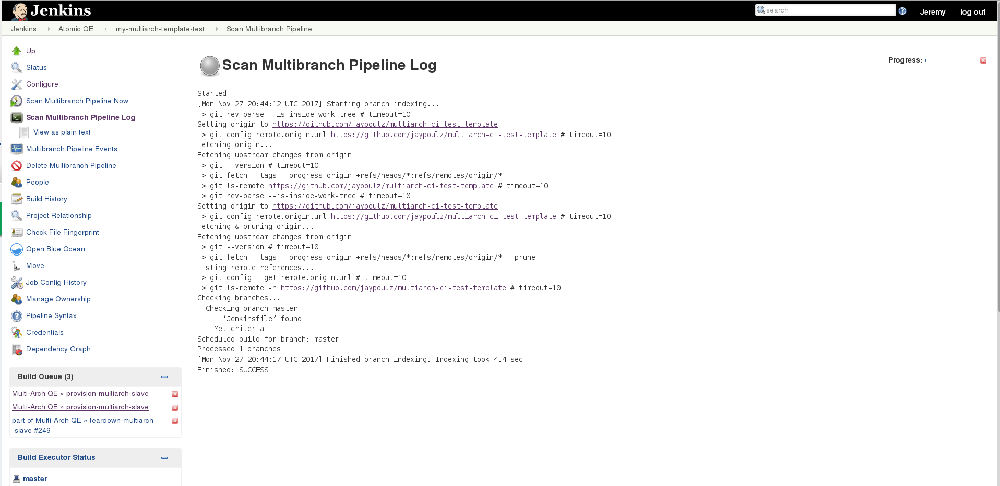
 
8. The test will be run automatically with the default build parameters, so just by waiting for the test to complete you should see the results of the first build just by browsing to the job. The easiest way to visualize the progress of your builds is to select Blue Ocean. From here, you can navigate down to your branches and see the result for each arch. Once completed, you can also retrieve the build artifacts from this view.
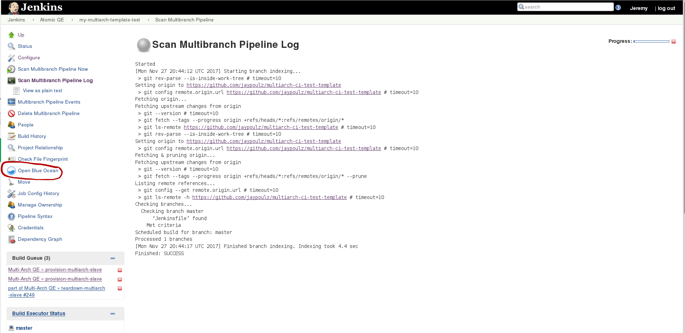
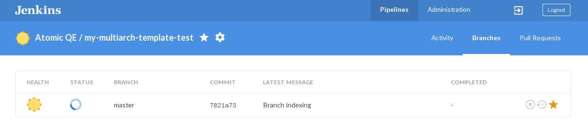
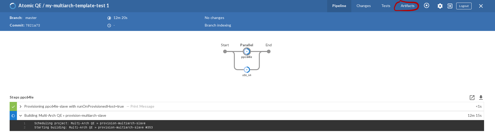

### Running the Test
1. To run a the test manually, start by logging in to [Multi-Arch QE Jenkins](https://multiarch-qe-jenkins.rhev-ci-vms.eng.rdu2.redhat.com).

2. Navigate to the test you want to run.

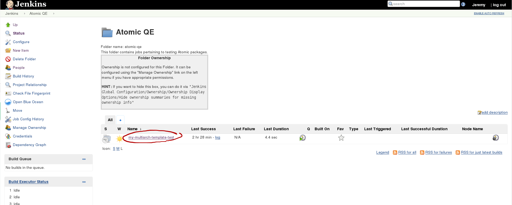
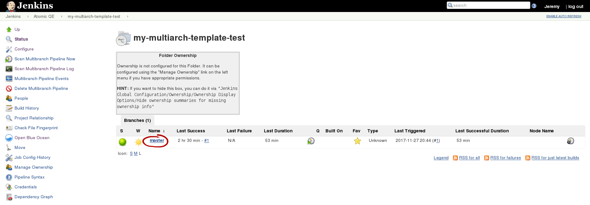
3. In the left panel, select `Build with Parameters`.
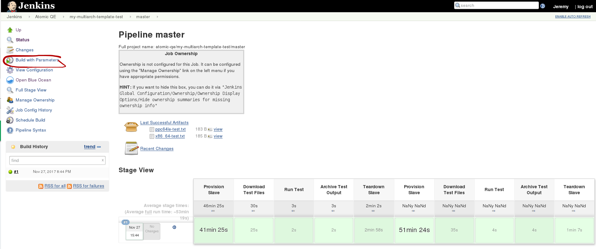
4. Specify the `ARCHES` you want to build on. This parameter takes a list of arches delimited by `,`. The supported arches are `x86_64`, `ppc64le`, `aarch64`, and `s390x`.
5. Specify the node to run the test from. This defaults to `master`, but could be a static slave.
6. Click `Build`.

## License
This project is licensed under the Apache 2.0 License - see the LICENSE file for details.

## Authors
This project would not be possible without the work of following people.
- [jaypoulz](https://github.com/jaypoulz/) - *Develops and maintains the current template.*
- [detiber](https://github.com/detiber/) - *Engineered the starting point for this template in [multiarch-openshift-ci](https://github.com/CentOS-PaaS-SIG/multiarch-openshift-ci).*
- [arilivigni](https://github.com/arilivigni) - *Provided basis of the Jenkinsfile via [ci-pipeline](https://github.com/CentOS-PaaS-SIG/ci-pipeline).*

## Further Documentation
For directions on how to add your own tests more details on the pipeline, please visit our [wiki](https://github.com/RedHat-MultiArch-QE/multiarch-ci-test-template/wiki).
